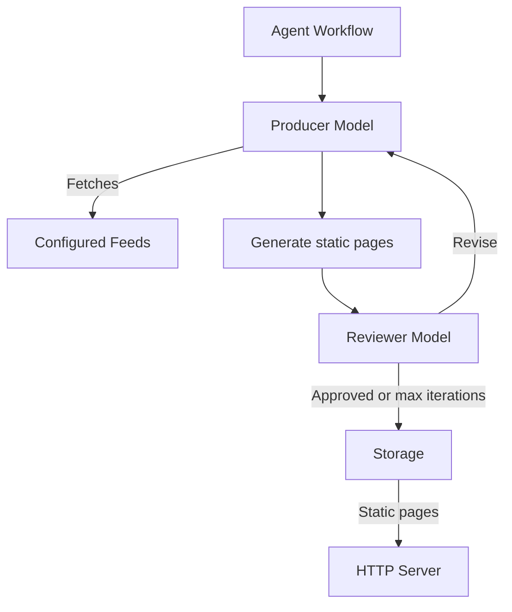

# xyz

matteodelseppia.xyz publishes brief daily updates from a curated list of feeds.

Feed sources are versioned in the GitHub repository. Updating them requires a new deployment.

## Conceptual Design

An agent periodically fetches the configured sources, summarizes relevant updates, generates static pages, and reviews the generated output before publishing it.

There is no human review. The producer and reviewer are separate models within the same agent workflow. The review loop continues until the reviewer accepts the output or the maximum number of iterations is reached.

