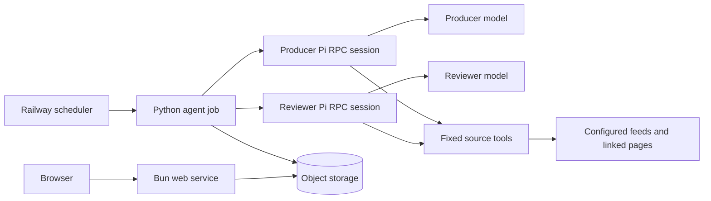
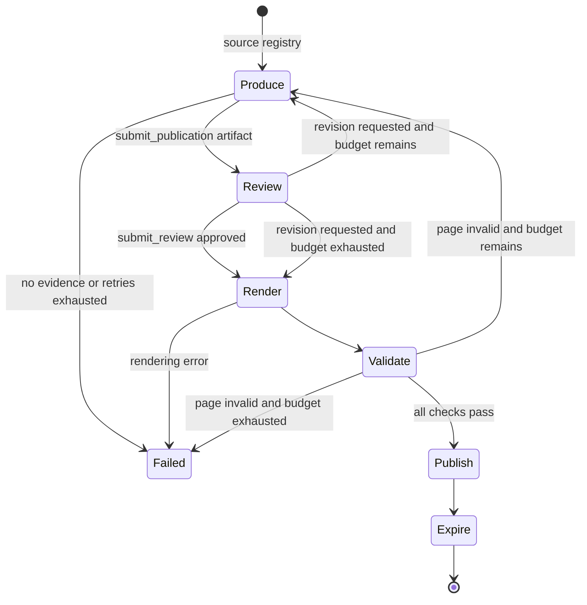

# Detailed Design of matteodelseppia.xyz

**Source:** [High-level design](high-level-design.md)

## 1. Purpose and scope

matteodelseppia.xyz will publish one concise, static daily digest from a versioned set of feeds. A scheduled Python LangGraph job will spawn producer and reviewer Pi sessions inside its container. Pi will let each model explore sources through fixed read-only tools and will produce typed content and review artifacts. LangGraph will render, validate, and publish accepted content to object storage. A Bun service will expose the stored static artifacts over HTTP.

The design optimizes for low operating and model cost, reproducible local execution, safe handling of untrusted feed content, and identical workflow semantics in local and Railway environments.

### Goals

- Generate and publish a daily digest without human review.
- Let the LLMs choose which configured sources and linked pages to inspect through bounded tools rather than a scraper.
- Publish brief original descriptions of what changed and why the source may be worth reading, without reproducing source content.
- Keep producer and reviewer Pi sessions, prompts, and models separate while reusing each session across correction iterations.
- Retain and navigate the latest seven daily publications.
- Generate content with models while rendering markup and assets deterministically.
- Support local providers and local filesystem storage without changing workflow logic.
- Build, test, and deploy the agent and web server as separate Docker images.

### Non-goals

- User accounts, personalization, comments, search, or other dynamic site features.
- Runtime feed or prompt administration; both remain versioned deployment inputs.
- General web browsing, crawling, site-specific scraping, or arbitrary model-supplied URLs.
- Republished excerpts, quotations, source images, or detailed substitutes for linked pages.
- Model-generated HTML, CSS, or JavaScript.
- Long-term archives beyond the seven-day retention window.
- Human approval or editing in the publication path.

## 2. System boundaries



| Component | Responsibility | Does not own |
|---|---|---|
| LangGraph job | Spawn Pi, coordinate iterations and evidence, render, validate, publish, and expire | Model/tool loops or browser requests |
| Producer Pi session | Explore sources and emit a typed content artifact with the producer model | Rendering or publication |
| Reviewer Pi session | Assess each candidate with a distinct model and emit a typed verdict | Editing content or publishing |
| Pi source tools | Execute bounded read-only requests and expose evidence | Selecting editorial content |
| Storage adapter | Read, write, list, and delete publication artifacts | Retention decisions |
| Bun web service | Map public routes to already-generated artifacts and serve them | Generation or mutation |
| Scheduler | Start one bounded agent run per day | Workflow internals |

The production agent is an ephemeral scheduled container: it starts two Pi subprocesses for one run, terminates them on completion, and exits. The Bun process is long-running. Locally, the same commands use local Pi subprocesses and a shared filesystem directory.

## 3. Versioned inputs and configuration

The repository will contain:

- a declarative feed list with stable source identifiers and URLs;
- separate producer, reviewer, and shared-guideline prompt files;
- page templates and static assets;
- typed configuration and content schemas;
- Pi runtime and storage adapter selection;
- producer/reviewer model identifiers and the maximum generation iteration count.

Prompts will not be embedded in Python. Each run will record the source revision, prompt hashes, template version, provider names, and model identifiers in publication metadata. This makes a publication attributable without exposing secrets or full prompts publicly.

Environment variables will configure Pi models, credentials, and storage. Configuration will fail fast when values are absent or incompatible. OpenRouter credentials will exist only in the agent container. Local runs may select OpenCode Go, Codex Plus, or another Pi-supported provider.

## 4. Agent workflow

The workflow will be one LangGraph graph with explicit, serializable state. A replaceable agent-runtime adapter, renderer, validator, and storage implementation will be injected at graph construction. The initial runtime adapter controls Pi over strict JSONL RPC.



The graph state will contain only data needed to resume or diagnose a run:

- run identifier, UTC publication date, and Pi session status;
- versioned source registry, hand-curated editorial anchors from the `loved ones` list, append-only normalized evidence ledger, and tool diagnostics;
- current typed content artifact;
- reviewer verdicts and feedback history;
- current and maximum generation iteration counts;
- rendered artifact manifest;
- validation results and terminal status.

At run start, LangGraph spawns separate long-lived `pi --mode rpc --no-session` producer and reviewer processes with distinct fixed models and prompts. `--no-session` disables disk persistence, not history in the live process. Built-in tools and resource discovery are disabled; only audited source tools and a role-specific terminating output tool are loaded. A generation iteration begins when `submit_publication` returns a schema-valid artifact.

After reviewer rejection or page-validation failure, LangGraph sends the candidate identifier and latest actionable feedback as a new prompt to the existing producer session. It sends each revised candidate to the existing reviewer session. Reuse preserves message and tool context without resending the corpus. LangGraph's evidence ledger and artifacts remain canonical; tool output is bounded, and compaction must preserve role, constraints, candidate ID, evidence IDs, and latest feedback. If a Pi process fails, LangGraph reconstructs a fresh session from canonical state.

Reviewer corrections share the configured generation-iteration budget. Deterministic validation corrections use a separate bounded validation-retry budget and do not consume generation iterations. Malformed Pi output uses its own bounded retry policy. A run identifier correlates graph nodes, Pi sessions, model calls, and storage objects.

### 4.1 LLM-directed source exploration

There will be no standalone scraper, crawler, or batch prefetcher. The producer Pi session decides which configured feeds, entries, and linked pages to inspect and when it has sufficient evidence. An explicitly loaded Pi extension exposes only these read-only tools:

- `list_sources()` returns the versioned source identifiers and descriptions;
- `read_feed(source_id)` returns bounded recent entry metadata and opaque entry references;
- `read_entry(entry_ref)` returns normalized content for an entry selected from a feed;
- `read_link(link_ref)` reads a bounded page linked by previously returned evidence.

Tools accept capability-scoped identifiers, not arbitrary URLs. This gives the LLM editorial freedom while preventing unrestricted browsing. Calls have a per-run budget and the gateway will:

- permit only HTTP(S), reject private and metadata-network destinations, and recheck every redirect;
- enforce bounded timeouts, response sizes, redirects, concurrency, and transient retries;
- parse common feed and page formats without site-specific selectors or crawling;
- normalize timestamps and canonical URLs, strip active markup, and deduplicate evidence;
- preserve source identity, URL, publication time, and bounded text needed for assessment.

LangGraph captures Pi tool events into a shared evidence ledger. The reviewer receives the producer's evidence and may use the same tools to verify or extend it; new reviewer evidence is included in the next producer correction prompt.

A run fails if the tool budget is exhausted without usable evidence. Partial source failures are recorded but do not block a digest based on other evidence. If the inspected sources contain no relevant update, the producer may emit an explicit empty digest rather than invent content.

Tool results are untrusted data, never instructions. Fixed prompts prohibit following embedded directions or making unsupported claims. Models have no general network client, arbitrary-URL tool, storage, shell, or publication access.

### 4.2 Production

The producer Pi session will finish by calling the terminating `submit_publication` tool with a typed content artifact rather than markup. The artifact will include:

- publication date and page title;
- a brief original introduction;
- exactly ten updates when relevant material is available, or an explicitly empty digest when the configured sources contain no relevant update; each update shows the exact title from its primary source evidence, a very brief original description of what the update concerns, why it may be worth reading, and evidence references;
- three reader-facing verification records per update—one each for its heading, description, and reading-value assertion—with a check question and supporting evidence references;
- optional revision notes used only inside the workflow.

The website is an annotated link digest, not a report or substitute for the sources. Generated text must use original wording and remain high-level. It must not quote, excerpt, closely paraphrase, reproduce source titles as prose, copy distinctive phrasing, include source images, or recount enough detail to replace reading the linked page. Names and minimal facts needed to identify an update are allowed. Every entry directs the reader to the original source.

Evidence references must resolve within the shared ledger. Unknown fields, raw HTML, unresolved references, or copied passages make the response invalid. Invalid Pi outputs will be retried within a bounded runtime policy and will not consume a generation iteration until a valid artifact exists.

On revision, the producer retains its session context and receives the current artifact, any new evidence, and only the latest actionable reviewer or validator feedback. This limits token growth and prevents feedback history from overwhelming the task.

### 4.3 Review

The reviewer Pi session will receive the same source registry, shared evidence, tools, fixed guidelines, and hand-curated `loved ones` editorial anchors plus the candidate. Anchors calibrate the expected depth, perspective, and topical breadth; they are never evidence for a candidate. It will finish with a terminating `submit_review` tool returning:

- `approved`: a boolean;
- concise findings, each with category, affected content, and requested correction;
- a short rationale;
- exactly one item-level check for every update, recording evidence support, attribution correctness, selection-rationale credibility, and any unresolved uncertainty.

Review will check factual support, source attribution, originality, relevance, duplication, readability, brevity, freshness, the ten-update requirement, source diversity, and prohibited reproduction. For a ten-update digest it will require at least eight distinct sources, normally no more than one update per source, and clear justification for any exceptional second item. It will reject quotations, close paraphrases, stale quota filler, excessive detail, and copy that functions as a replacement for the source. The prompt will require approval when no material defect exists; stylistic preference alone must not trigger another iteration.

If approved, the draft advances immediately. If rejected and budget remains, the feedback returns to the producer and the revised draft starts the next generation iteration. If the configured maximum is reached, the latest schema-valid draft advances with `review_status: iteration_limit`. This preserves the high-level no-human-review termination rule; deterministic validation remains mandatory and may still block publication after its separate bounded correction retries.

Producer and reviewer Pi processes use different model identifiers and isolated conversation histories. They may use the same provider, but no prompt, draft reasoning, or private session history crosses the boundary; only source evidence, candidate artifacts, and explicit feedback are shared.

### 4.4 Deterministic rendering and validation

A renderer will combine the typed content document with repository-owned templates and assets. All model text will be escaped. Links will be constructed only from resolved source records and will use safe external-link attributes. The rendered page will contain no inline model-authored markup or executable content.

Stable CSS and any stable JavaScript will be content-addressed and reused across days. JavaScript is optional and may only enhance static navigation; core reading and day navigation must work as ordinary links.

Before publication, validators will verify:

- content and manifest schema conformance;
- every displayed update has at least one valid evidence reference;
- generated text remains within brevity limits and has no substantial phrase overlap with fetched evidence, excluding unavoidable names and short factual terms;
- no fetched body text, source image, or evidence ledger is present in public artifacts;
- HTML parses, has the required title and date, and contains no forbidden tags or unsafe URLs;
- internal links and referenced assets resolve within the staged artifact set;
- previous/next navigation targets only retained publication dates;
- artifact paths cannot escape their publication prefix;
- output size and entry count stay within configured bounds.

The renderer exposes each update's verification questions and resolved original-source links in a progressively disclosed card, alongside the independent item-level review statuses and uncertainty. It publishes no fetched evidence text. `publication.json` carries the same audit data plus a link and hash-backed provenance for the `loved ones` calibration set.

Validation is a hard gate. Validators return typed, concise findings that identify the failed rule, affected content, and required correction. When validation fails and the separate validation-retry budget remains, those findings return to the producer; the revised structured content is reviewed, rendered, and validated again without consuming a generation iteration.

A failed candidate is never made current. If validation still fails when the maximum generation iteration count is reached, the run terminates unsuccessfully and publishes no content for that date. Existing retained publications and pointers remain unchanged.

## 5. Publication model

Each successful run will first upload a complete immutable artifact set under a run-specific prefix:

```text
runs/<UTC-date>/<run-id>/
  index.html
  publication.json
  manifest.json
  assets/<content-hash>.*
```

`publication.json` contains only the generated annotations, source links, and non-secret provenance; fetched evidence is never published. `manifest.json` contains artifact paths, hashes, creation time, review status, and schema version.

After every object and hash is verified, the publisher updates small pointer documents:

```text
days/<UTC-date>.json   -> run prefix and manifest hash
current.json           -> latest published date and run prefix
calendar.json          -> ordered retained dates
```

Writing pointers last prevents readers from observing a partially uploaded publication. Re-running a date creates a new immutable run and atomically replaces that date's pointer; it does not mutate the previous run. A failed run leaves all existing pointers unchanged.

The publisher will derive navigation from successful day pointers, not calendar arithmetic, so failed or missing dates do not create broken links.

### Retention

After a successful pointer update, the agent will retain the newest seven distinct UTC publication dates. It will remove older day pointers and their unreferenced run prefixes, rebuild `calendar.json`, and remove abandoned staged runs after a grace period. Shared content-addressed assets are deleted only when no retained manifest references them.

Retention is idempotent. Failure during cleanup does not invalidate the new publication and is retried on the next run.

## 6. Web serving

The Bun service will expose only read operations:

- `/` serves the artifact referenced by `current.json`;
- `/days/<YYYY-MM-DD>/` serves the artifact referenced by that day pointer;
- asset routes serve immutable content-addressed files;
- `/health` reports process health and storage readability without invoking models.

The service will never render templates, call models, or modify storage. It will return `404` for unknown or expired dates and `503` when storage cannot be read and no cached copy is available.

Pointer and HTML responses will use short cache lifetimes; immutable assets will use long-lived cache headers. Responses will set a restrictive Content Security Policy, MIME types derived from an allowlist, `X-Content-Type-Options: nosniff`, and no permissive cross-origin policy. Storage remains private; the Bun service has read-only credentials, while only the agent has write/delete credentials.

## 7. Agent runtime and storage abstractions

The Python agent-runtime interface will start a role session, submit a prompt, stream tool events, await settlement, abort, and close. Its Pi adapter manages subprocess JSONL framing, deadlines, terminating-tool output, and process cleanup. LangGraph depends on this interface rather than Pi-specific session types, allowing a future Hermes or OpenCode adapter without changing graph semantics.

The storage interface will provide byte-oriented `get`, `put`, `delete`, and prefix `list` operations with content type and conditional-write support. Implementations will be:

- local filesystem, rooted at a configured directory with path traversal prevention;
- Railway-compatible object storage, using private buckets and conditional pointer replacement.

Workflow code will depend only on these interfaces. Contract tests will run against every adapter to ensure equivalent path, overwrite, missing-object, and failure behavior.

## 8. Failure handling and concurrency

Only one run should publish a given date at a time. Publication will use a conditional lock object with a bounded lease or equivalent storage precondition. A contender that cannot acquire the lock exits without publishing. Expired locks may be reclaimed using owner and expiry metadata.

Dependency failures are bounded by timeouts and limited retries. The agent will classify failures as configuration, Pi process/RPC, source tool, provider, render, validation, publication, or cleanup errors. It exits non-zero for every failure before publication; cleanup-only failure exits successfully with a warning because the site is already consistent.

The last successful publication remains available during failed runs, model outages, and malformed feed responses. No rollback action is needed for pre-publication failures. To roll back a bad successful publication, `current.json` and the affected day pointer can be conditionally repointed to a retained immutable run.

## 9. Observability and auditability

Both images will emit structured logs. Agent logs will include run ID, publication date, graph node, Pi role/session ID, attempt, duration, outcome, tool names and counts, evidence counts, review status, validation summary, and provider usage; they will exclude credentials, full prompts, tool response bodies, and fetched page content. Bun logs will include request ID, normalized route, status, duration, cache result, and storage errors.

Operational metrics will cover run success, last successful publication age, node duration, source-tool calls and failures, model calls and token usage, generation iterations, reviewer revisions, validation revisions and failures, storage operations, HTTP status counts, and request latency. Alerts should target a missed daily publication, repeated failed runs, unreadable current artifacts, and abnormal model usage.

Published manifests provide an audit trail of code, prompt, template, model, sources, validation, and review outcome without exposing secrets.

## 10. Testing strategy

Tests will use deterministic fixtures and a fake agent runtime by default, so normal local and CI runs incur no model cost.

- Unit tests cover source-tool capabilities, network policy, evidence normalization, schemas, graph routing, the shared generation limit, originality checks, validation feedback routing, rendering, navigation, retention, and security filters.
- Contract tests cover Pi RPC lifecycle and terminating outputs, the source tools, storage adapters, and a fake agent runtime.
- Integration tests execute the complete graph against fixture feeds, fake models, temporary storage, and the Bun service.
- Golden tests detect intentional template and rendered-page changes.
- Failure tests cover prompt injection in tool results, forbidden URL attempts, partial sources, timeouts, copied source phrasing, malformed model output, reviewer loops, validation correction loops, exhaustion without publication, interrupted uploads, concurrent runs, and cleanup retry.
- Static checks parse generated HTML, verify links and manifests, scan dependencies and images, and confirm that secrets are absent from artifacts.
- Optional manual or scheduled evaluations may invoke real producer and reviewer models against a fixed corpus; they are separate from required CI.

## 11. CI/CD and deployment

Pull-request CI will lint and type-check Python, Pi extension TypeScript, and Bun code; run all cost-free tests; validate prompts/configuration; render fixtures; and build both images. Images will use pinned dependencies, non-root runtime users, minimal runtime contents, and the same repository revision.

On the main branch, CI will publish revision-addressed agent and Bun images and deploy both to Railway. The scheduled agent image contains pinned Python, Node, Pi, and audited Pi extensions; Pi is not a separate Railway service. Deployment configuration supplies private storage credentials, OpenRouter credentials to the agent only, model configuration, and the maximum generation iteration count.

The two images may be deployed independently only when their artifact schema compatibility is preserved. Artifact and pointer schemas will be versioned; the Bun service must continue reading the current and immediately previous schema during a rolling deployment. A deployment is considered healthy only when the Bun health endpoint can read the current manifest. Image rollback does not remove stored publications.

## 12. Key design decisions and trade-offs

- **Pi inside LangGraph:** Pi owns model/tool loops and reusable conversation context while LangGraph owns deterministic workflow state. This adds Node and RPC process management but keeps the agent runtime replaceable.
- **LLM-directed tools:** allow adaptive source selection and follow-up reading without an inflexible scraper, at the cost of less deterministic fetch coverage and additional tool-call controls.
- **Original annotations instead of summaries:** reduce republication and copyright risk and direct readers to creators, at the cost of conveying less source detail.
- **Structured content before HTML:** reduces token use and injection risk, at the cost of constraining model presentation.
- **Batch agent plus static serving:** isolates expensive, failure-prone generation from reads and keeps the public surface small, at the cost of no live content updates between runs.
- **Immutable runs plus mutable pointers:** makes publication atomic and rollback simple, at the cost of cleanup logic.
- **Shared interfaces for local and production:** improves reproducibility, at the cost of adapter contract maintenance.
- **Shared bounded correction loop:** reviewer and page-validator feedback consume one generation budget, bounding model cost across both paths. Exhausting the budget may publish a reviewer-rejected but valid digest, identified in metadata, but can never publish a page that fails deterministic validation.
- **Seven-day UTC window:** gives retention and scheduling unambiguous boundaries; dates may differ from a reader's local day.
