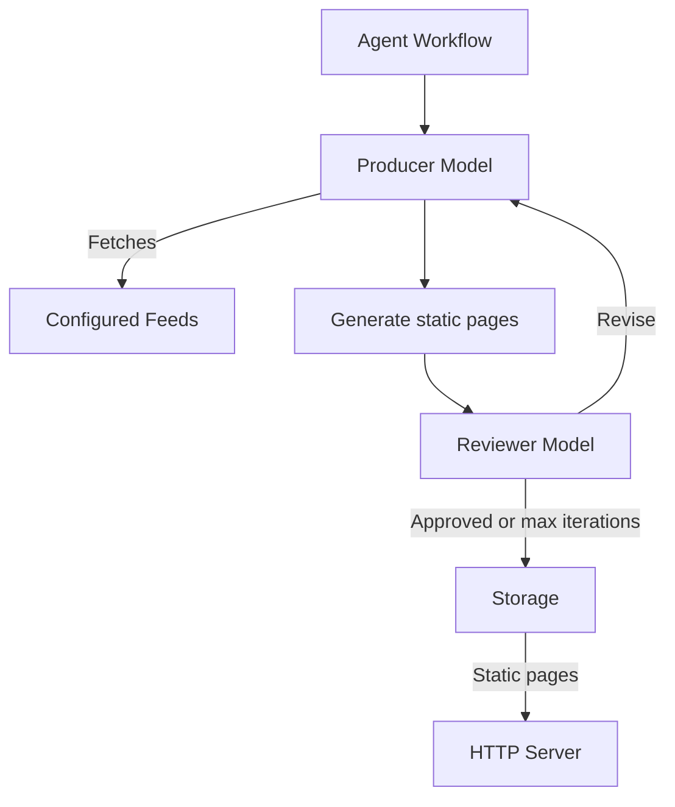
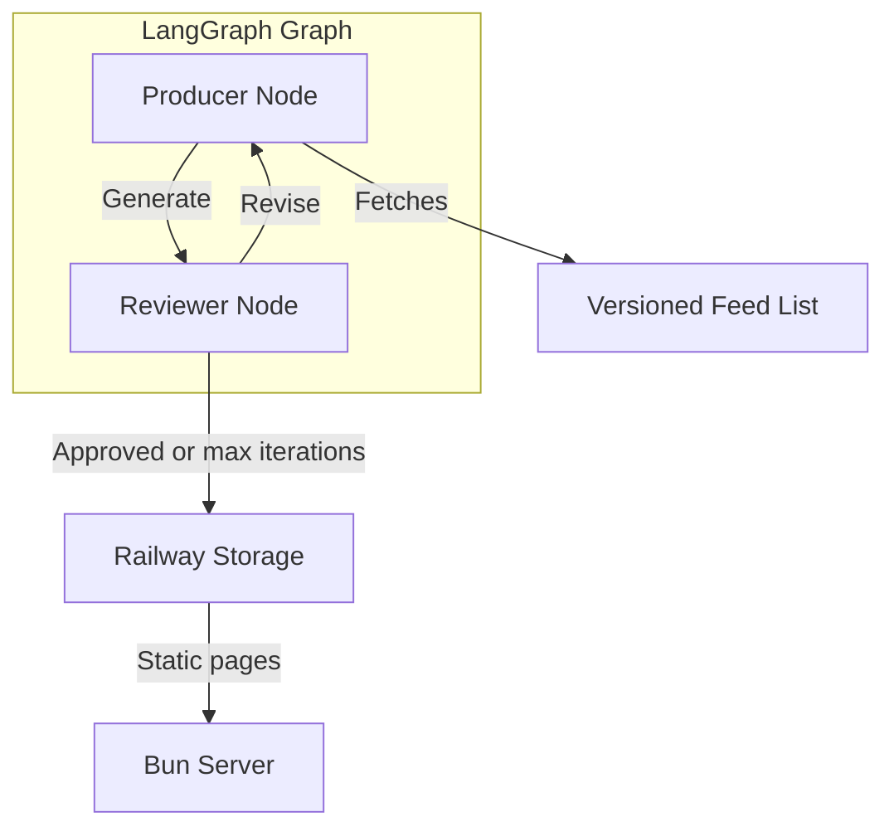

# High-Level Design of matteodelseppia.xyz

matteodelseppia.xyz publishes brief daily updates from a curated list of feeds.

Feed sources are versioned in the GitHub repository. Updating them requires a new deployment.

## Conceptual Design

An agent periodically fetches the configured sources, summarizes relevant updates, generates static pages, and reviews the generated output before publishing it.

There is no human review. The producer and reviewer are separate models within the same agent workflow. The review loop continues until the reviewer accepts the output or the maximum number of iterations is reached.

## Desired Implementation

The agent is implemented as a single LangGraph graph in Python. The graph contains separate producer and reviewer nodes, backed by different predefined models accessed through OpenRouter.

The OpenRouter API key is provided as a deployment secret.

### Detailed Design Guidelines

1. The service must be reproducible and testable locally using local storage. Local execution must support alternative model providers such as OpenCode Go or Codex Plus to avoid unnecessary OpenRouter costs.

2. Provider, storage, and runtime abstractions must be designed upfront so local and Railway execution share the same behavior wherever possible.

3. Prompts must be stored outside Python source code and versioned independently.

4. The website must expose only static interactions.

5. CI/CD is a first-class design concern, taking inspiration from the workflows in `matteodelseppia/fold.link`. Deployment to Railway must build and deploy two Docker images: one for the Bun server and one for the LangGraph agent.

6. Generated daily pages must be retained in object storage for seven days and exposed through navigation such as "yesterday" or previous days. Older artifacts must be deleted automatically.

7. Page structure and styling must be template-driven. The agent should generate content, not repeatedly regenerate stable HTML, CSS, or JavaScript, in order to reduce token usage.

8. The reviewer must receive the same source input available to the producer, together with shared fixed guidelines. It should produce concise, actionable feedback and avoid unnecessary revision cycles. The review policy should favor acceptance when the output satisfies the requirements, minimizing token usage while still catching material issues.

9. The output produced by the producer shall be subject to some kind of automated testing to verify integrity of the static content.